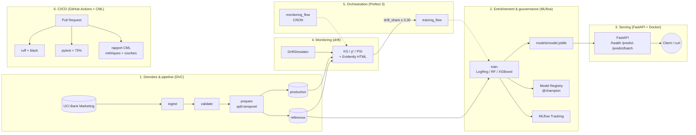

# Architecture MLOps — vue d'ensemble

```mermaid
flowchart LR
    subgraph DATA["1. Données & pipeline (DVC)"]
        UCI[(UCI Bank Marketing)] --> ING[ingest]
        ING --> VAL[validate]
        VAL --> PREP[prepare<br/>split temporel]
        PREP --> REF[(référence)]
        PREP --> PROD[(production)]
    end

    subgraph TRAIN["2. Entraînement & gouvernance (MLflow)"]
        REF --> TR[train<br/>LogReg / RF / XGBoost]
        TR --> MLF[MLflow Tracking]
        TR --> REG[Model Registry<br/>@champion]
        TR --> ART[models/model.joblib]
    end

    subgraph SERVE["3. Serving (FastAPI + Docker)"]
        ART --> API[FastAPI<br/>/health /predict /predict/batch]
        API --> USER((Client / curl))
    end

    subgraph MON["4. Monitoring (drift)"]
        PROD --> DRIFT[KS / χ² / PSI<br/>+ Evidently HTML]
        SIM[DriftSimulator] --> DRIFT
        REF --> DRIFT
    end

    subgraph ORCH["5. Orchestration (Prefect 3)"]
        FLOWT[training_flow] -.-> TR
        FLOWM[monitoring_flow<br/>CRON] -.-> DRIFT
        DRIFT -- "drift_share ≥ 0.30" --> FLOWT
    end

    subgraph CI["6. CI/CD (GitHub Actions + CML)"]
        PR[Pull Request] --> LINT[ruff + black]
        PR --> TEST[pytest > 75%]
        PR --> CMLR[rapport CML<br/>métriques + courbes]
    end
```

À compléter au fil du projet (schéma de déploiement Docker, workflow CI détaillé).
